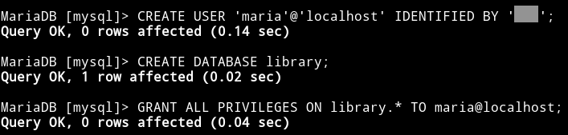
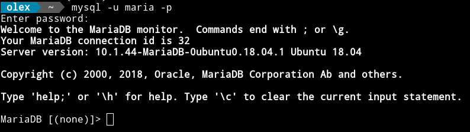
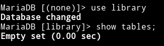

### Практична робота 1

Створення структури таблиць і введення вмісту
=============================================

Від імені адміністратора СУБД MariaDB cтворюємо базу даних (БД) _library_:

```sql
CREATE DATABASE library;
```
створюємо користувача _maria_:

```sql
CREATE USER 'maria'@'localhost' IDENTIFIED BY 'password';
```
та надаємо користувачу _maria_ привілеї для роботи з БД _library_ :

```sql
GRANT ALL PRIVILEGES ON library.* TO maria@localhost;
```


Авторизуємося від імені користувача _maria_... 

```
> mysql -u maria -p 
```


вибираємо БД _library_ та перевіяємо її..

```sql
use library;
show tables;
```


вона порожня (не містить таблиць).

Підготуємо дані для створення таблиць. У файлі _tables.sql_ розмістимо SQL-код для створення таблиць книжок та читачів: _books_ та _readers_ відповідно.

```sql
CREATE TABLE books (
  bid   SMALLINT UNSIGNED NOT NULL,  /* BookID */
  title VARCHAR(20)       NOT NULL,
  autor VARCHAR(30)       NOT NULL,
  publ  YEAR              NOT NULL,  /* year of PUBLication */
  price SMALLINT UNSIGNED NOT NULL
) ENGINE=MyISAM;

CREATE TABLE readers (
  rid     SMALLINT  UNSIGNED NOT NULL,  /* ReaderID */
  name    VARCHAR(20)        NOT NULL,
  class   SMALLINT  UNSIGNED NOT NULL,
  dateout DATE               NOT NULL,
  datein  DATE                   NULL,
  bid     SMALLINT  UNSIGNED NOT NULL   /* BookID */
) ENGINE=MyISAM;
```
