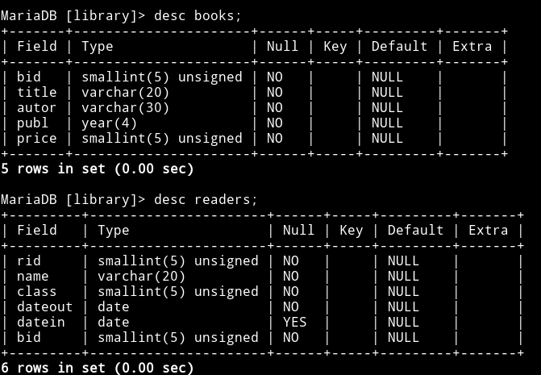

### Практична робота 1

Створення структури таблиць і введення вмісту
=============================================

Від імені адміністратора СУБД MariaDB cтворюємо базу даних (БД) **_library_**:

```sql
CREATE DATABASE library;
```
створюємо користувача **_maria_**:

```sql
CREATE USER 'maria'@'localhost' IDENTIFIED BY 'password';
```
та надаємо користувачу **_maria_** привілеї для роботи з БД **_library_** :

```sql
GRANT ALL PRIVILEGES ON library.* TO maria@localhost;
```


Авторизуємося від імені користувача **_maria_**... 

    > mysql -u maria -p 


вибираємо БД **_library_** та перевіяємо її..

```sql
USE library
SHOW tables;
```


вона порожня (не містить таблиць).

Підготуємо структуру для майбутніх таблиць (назви полів, їх тип). У файлі **tables.sql** розмістимо такий SQL-код для створення таблиць книжок та читачів: **_books_** та **_readers_** відповідно.

```sql
CREATE TABLE books (
  bid   SMALLINT UNSIGNED NOT NULL,  /* BookID */
  title VARCHAR(20)       NOT NULL,
  autor VARCHAR(30)       NOT NULL,
  publ  YEAR              NOT NULL,  /* year of PUBLication */
  price SMALLINT UNSIGNED NOT NULL
) ENGINE=MyISAM;

CREATE TABLE readers (
  rid     SMALLINT  UNSIGNED NOT NULL,  /* ReaderID */
  name    VARCHAR(20)        NOT NULL,
  class   SMALLINT  UNSIGNED NOT NULL,
  dateout DATE               NOT NULL,
  datein  DATE                   NULL,
  bid     SMALLINT  UNSIGNED NOT NULL   /* BookID */
) ENGINE=MyISAM;
```
Виконуємо SQL-код для нашої бази даних, входимо в неї, та перевіряємо наявність таблиць:

    > mysql -u maria -p library < /home/olex/docs/masha/tables.sql


Перевіряємо структуру таблиць:

```sql
DESC book;
DESC readers;
```


Створемо файл **data.sql** де розмістимо SQL-код для наповнення заданими даними таблиць **_books_** та **_readers_**.

```sql
INSERT INTO books () VALUES
(201, "Фізика",      "Федірко К.О.", 2016, 33),
(202, "Фізика",      "Федірко К.О.", 2016, 33),
(203, "Фізика",      "Мехов А.С.",   2017, 35),
(204, "Фізика",      "Мехеда О.Н.",  2017, 40),
(205, "Фізика",      "Мехеда О.Н.",  2017, 40),
(206, "Iнформатика", "Соломко І.М.", 2017, 45),
(207, "Iнформатика", "Соломко І.М.", 2017, 45),
(208, "Iнформатика", "Соломко І.М.", 2017, 45),
(209, "Iнформатика", "Федірко К.О.", 2015, 43),
(210, "Iнформатика", "Мехеда О.Н.",  2018, 50),
(211, "Iнформатика", "Соломко І.М.", 2018, 55),
(212, "Iнформатика", "Соломко І.М.", 2018, 55);

INSERT INTO readers () VALUES
( 1, "Перов С.М.",    10, "2018-02-05", "2018-03-10", 201),
( 2, "Соломаха К.К.", 11, "2018-02-10", "2018-03-22", 206),
( 3, "Басов А.С.",    10, "2018-02-15", "2018-03-26", 207),
( 4, "Перов С.М.",    10, "2018-02-16", "2018-03-27", 208),
( 5, "Пекар Н.Н.",    11, "2018-02-16", "2018-03-30", 203),
( 6, "Ахтирко М.О.",  10, "2018-02-18", "2018-03-30", 204),
( 7, "Агапова К.М.",  11, "2018-04-03", "2018-04-15", 201),
( 8, "Настіна О.С.",  11, "2018-04-03",  NULL,        210),
( 9, "Басов А.С.",    10, "2018-04-06",  NULL,        212),
(10, "Ріпко П.С.",    10, "2018-04-06", "2018-04-16", 209),
(11, "Соломаха К.К.", 11, "2018-04-06", "2018-04-19", 203);
```

Виконуємо SQL-код для нашої бази даних, входимо в неї, та перевіряємо наявність даних в таблицях:

    > mysql -u maria -p library < /home/olex/docs/masha/data.sql

```sql
SELECT * FROM books;
SELECT * FROM readers;
```


Д


