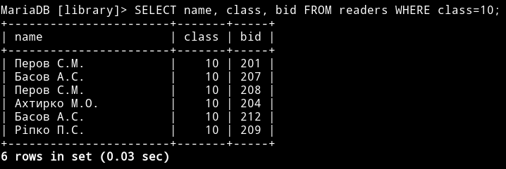
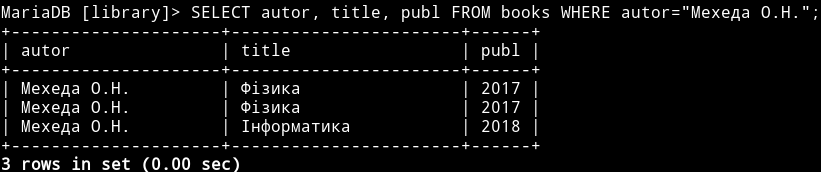
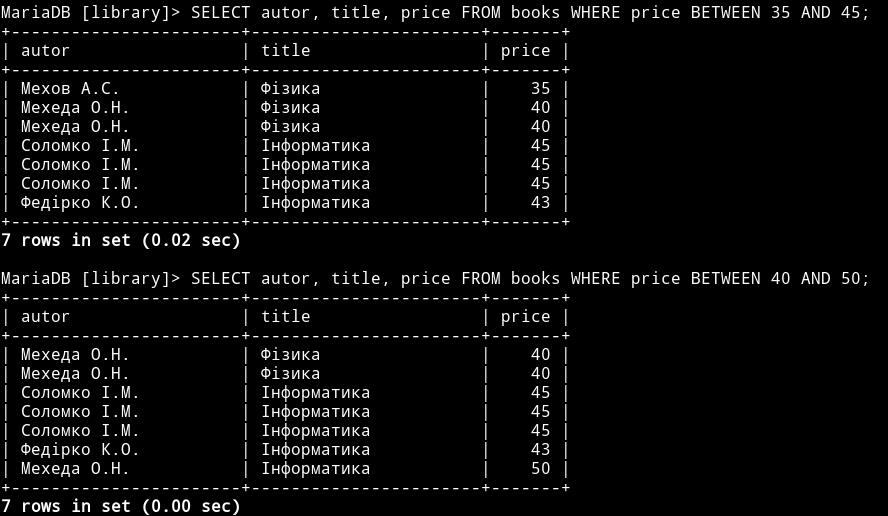
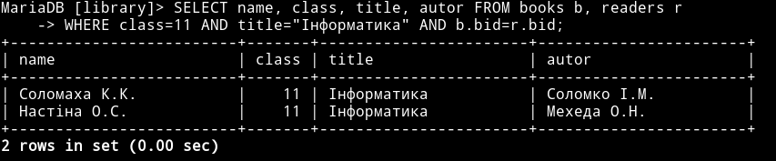
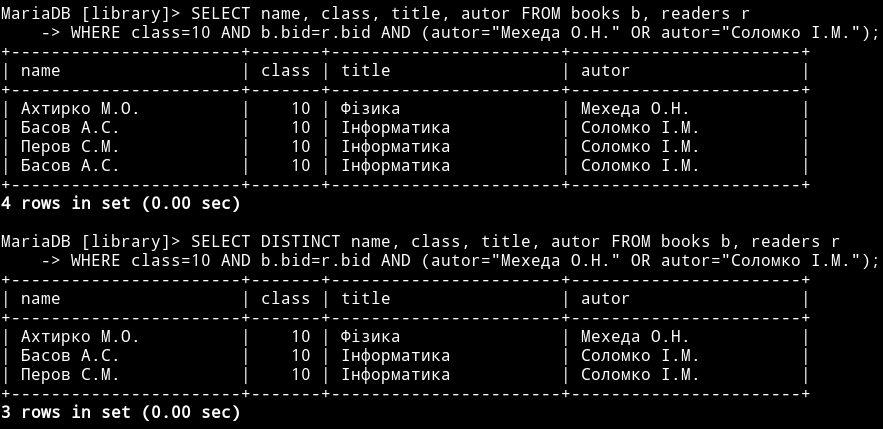
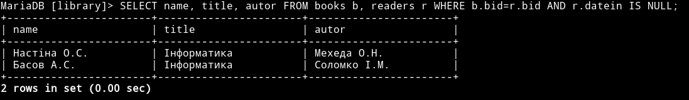
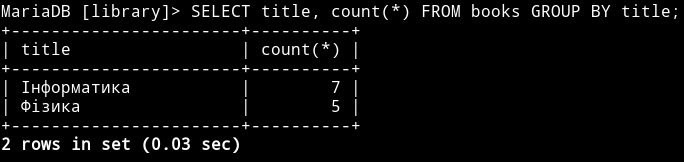
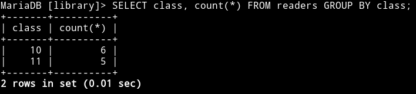
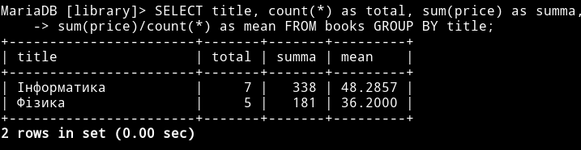
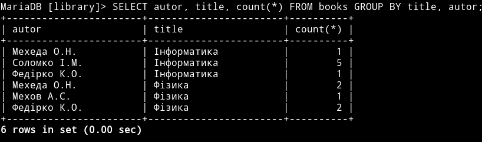

### Практична робота 3

Запити з функціями та полями, що обчислюються
=============================================

Тут – номер запиту, рішення – SQL-код, та скріншот його виконання.

### 151

```sql
SELECT name, class, bid FROM readers WHERE class=10;
```


### 152

```sql
SELECT autor, title, publ FROM books WHERE autor="Мехеда О.Н.";
```



### 153 + 154

```sql
SELECT autor, title, price FROM books WHERE price BETWEEN 35 AND 45;
SELECT autor, title, price FROM books WHERE price BETWEEN 40 AND 50;
```



### 155

```sql
SELECT name, class, title, autor FROM books b, readers r WHERE class=11 AND title="Iнформатика" AND b.bid=r.bid;
```



### 156

```sql
SELECT name, class, title, autor FROM books b, readers r 
WHERE class=10 AND b.bid=r.bid AND (autor="Мехеда О.Н." OR autor="Соломко І.М.");
```

або

```sql
SELECT DISTINCT name, class, title, autor FROM books b, readers r 
WHERE class=10 AND b.bid=r.bid AND (autor="Мехеда О.Н." OR autor="Соломко І.М.");
```




### 157

```sql
SELECT name, title, autor FROM books b, readers r WHERE b.bid=r.bid AND r.datein IS NULL;
```




### 158

```sql
SELECT title, count(*) FROM books GROUP BY title;
```



### 159

```sql
SELECT class, count(*) FROM readers GROUP BY class;
```




### 160

```sql
SELECT title, count(*) as total, sum(price) as summa,
sum(price)/count(*) as mean FROM books GROUP BY title;
```



### 161

```sql
SELECT autor, title, count(*) FROM books GROUP BY title, autor;
```

