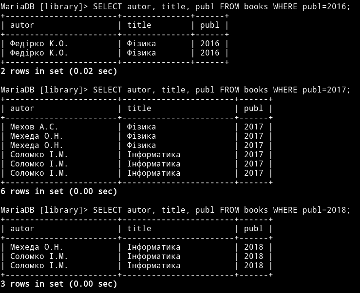
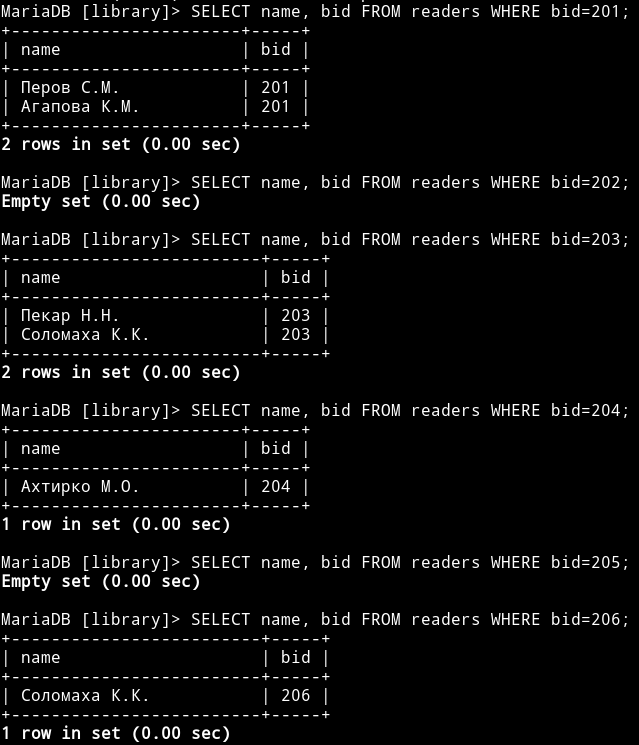
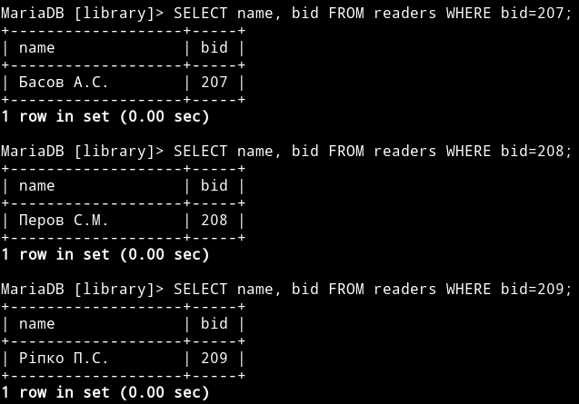
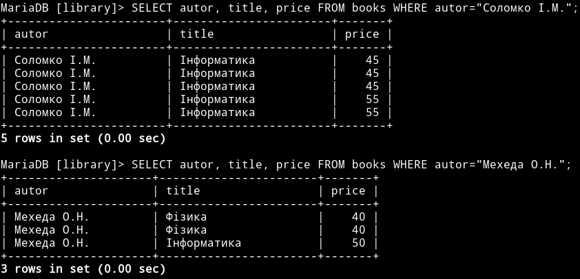
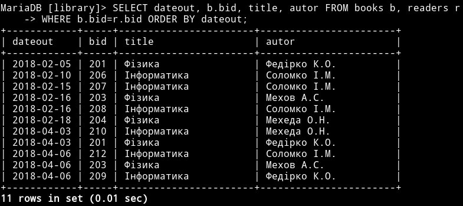
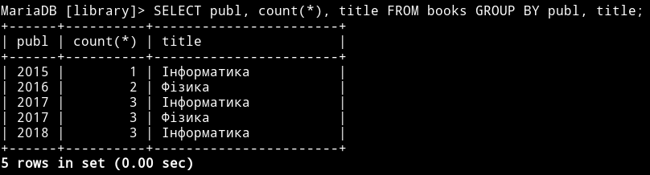
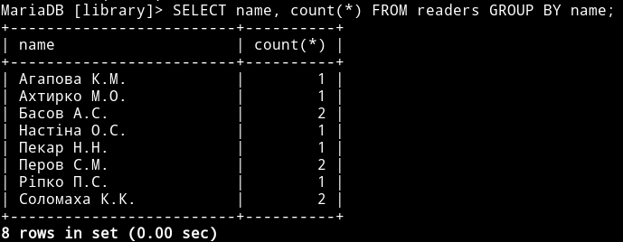

### Практична робота 4

Запити з параметрами, перехресні запити і запити на змінення данних
===================================================================

Тут – номер запиту, рішення – SQL-код, та скріншот його виконання.

### 171

```mysql
SELECT autor, title, publ FROM books WHERE publ=2016;
```


### 172

```sql
SELECT name, bid FROM readers WHERE bid=999;
```





### 173

```sql
SELECT autor, title, price FROM books WHERE autor="Соломко І.М.";
SELECT autor, title, price FROM books WHERE autor="Мехеда О.Н.";
```



### 174

```sql
SELECT dateout, b.bid, title, autor FROM books b, readers r
WHERE b.bid=r.bid ORDER BY dateout;
```



### 175

```sql
SELECT publ, count(*), title FROM books GROUP BY publ, title;
```



### 176

```sql
SELECT name, count(*), title FROM readers GROUP BY name;
```


